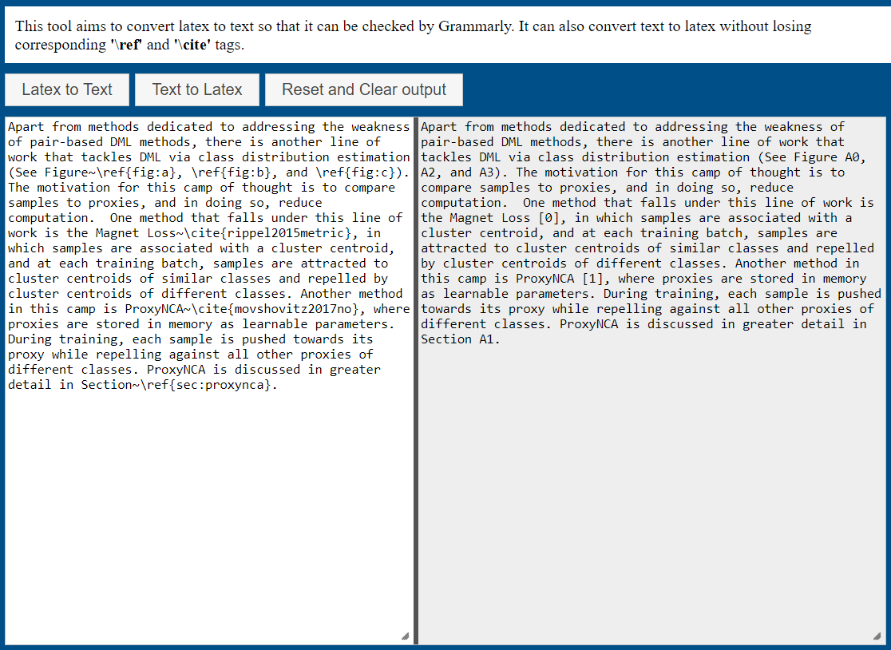

# Latex to Text, and Text to Latex Converter

This tool aims to convert latex to text so that it can be checked by Grammarly. It can also convert text to latex without losing corresponding '\ref' and '\cite' tags.

To use this tool in your browser, first clone the repo and then launch a python default webserver in the repo directory. After that, visit localhost:1111 to use the tool. 
	
    #for python2
    python -m SimpleHTTPServer 1111
    # for python3
    python -m http.server 1111

or you could visit www.euwern.com/latex_grammarly. 

